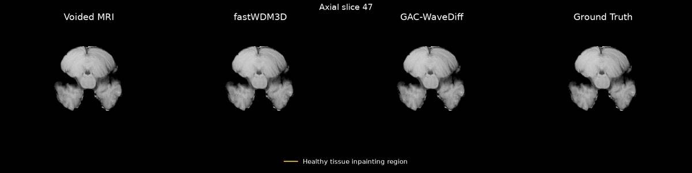

<div align="center">

# GAC-WaveDiff

### Geometry-Aware Conditional 3D Wavelet Diffusion for Pseudo-Healthy Brain MRI Inpainting

***Evelyne Calista<sup>1</sup> &nbsp; · &nbsp; Yong-Sheng Chen<sup>1</sup> &nbsp; · &nbsp;***


<sup>1</sup>National Yang Ming Chiao Tung University, Taiwan
</div>
<p align="center">
  <a href="https://papers.miccai.org/miccai-2026-sat/BraTS_Inpainting_011.html">Paper</a>
</p>

### sixth place of BraTS Inpainting 2026
## Overview

This repository is for Geometry-Aware Conditional 3D Wavelet Diffusion for Pseudo-Healthy Brain MRI Inpainting, in part of BraTS 2026 Inpainting Challenge

<p align="center">
  
</p>


## Installation
Install dependencies:
```bash
conda env create -f environment.yml
```

## Data Preparation

Describe where the dataset can be obtained and how it should be organized.

```text
data/
├── train/
├── validation/
└── test/
```

## Training

```bash
bash run.sh
```

## Inference

```bash
bash run_inference.sh
```


## Citation

When using this repository, please cite:
```
@InProceedings{CalEve_GeometryAware_MICCAISAT2026,
        author = { Calista, Evelyne AND Chen, Yong-Sheng},
        title = { { Geometry-Aware Conditional 3D Wavelet Diffusion for Pseudo-Healthy Brain MRI Inpainting } },
        booktitle = {Medical Image Computing and Computer Assisted Intervention -- MICCAI 2026 Workshops and Challenges},
        year = {2026},
        publisher = {Springer Nature Switzerland},
        volume = {LNCS 17254},
        month = {pending},
        page = {pending}
}
```

## Acknowledgements
This repository uses dataset [BraTS 2026 Inpainting Challenge](https://challenges.synapse.org/Challenges/DetailsPage/Task4?id=syn74274097).
Thanks to Durrer et al. for releasing their code [fastWDM3D](https://github.com/AliciaDurrer/fastWDM3D).


## License

This project is licensed under the [LICENSE NAME](LICENSE).


```
```
